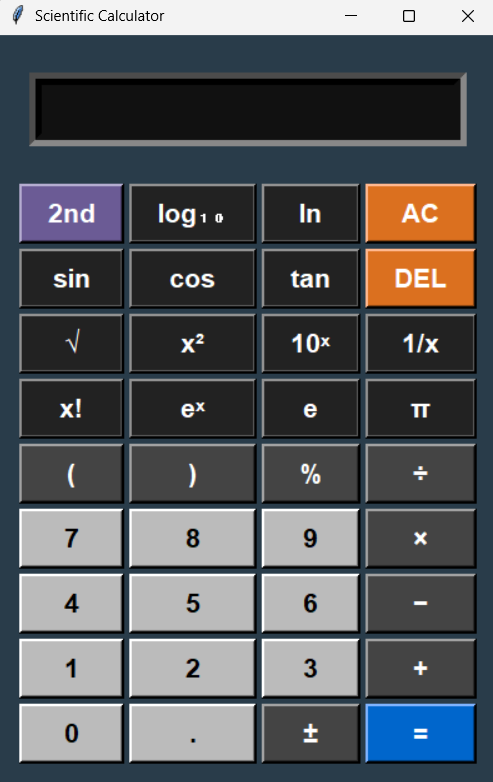

# Scientific Calculator

A desktop scientific calculator built with Python and Tkinter, featuring both mouse and keyboard input.

## Features

- **Standard & Scientific Functions**: Arithmetic (`+ - * /`), exponentiation (`^`), roots, trigonometry, factorial, logarithms, constants (π, e), percentage.
- **Safe Evaluation**: Uses a restricted evaluation environment to prevent arbitrary code execution.
- **Separation of Concerns**: Core logic lives in `calculator_engine.py`, UI in `calculator_ui.py`.
- **Keyboard Shortcuts**:
  - Digits & operators: `0-9 . + - * / ^`
  - Enter (Return): Evaluate
  - Backspace: Delete last character
  - `Q`: Square (x²)
  - `R`: Reciprocal (1/x)
  - `T`: Tangent
  - `O`: Cosine
  - `S`: Sine
  - `P`: Insert π
  - `E`: Insert e
  - `Y`: Power operator (`^`)
  - `L`: Log base 10
  - `N`: Natural log (ln)

## Screenshot

Here’s what the calculator looks like:

## Installation

1. Ensure you have Python 3.7+ installed.
2. Clone the repository.
3. Install Tkinter.

## Contributing

Contributions are welcome! Feel free to:

- Open issues for bugs or feature requests.
- Submit pull requests with enhancements or fixes.

## License

This project is licensed under the [MIT License](LICENSE).
